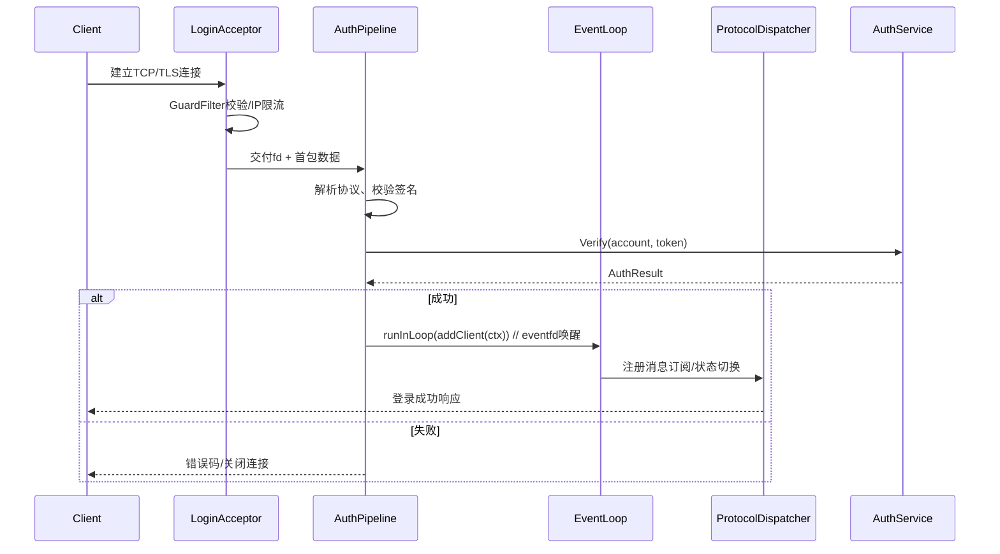
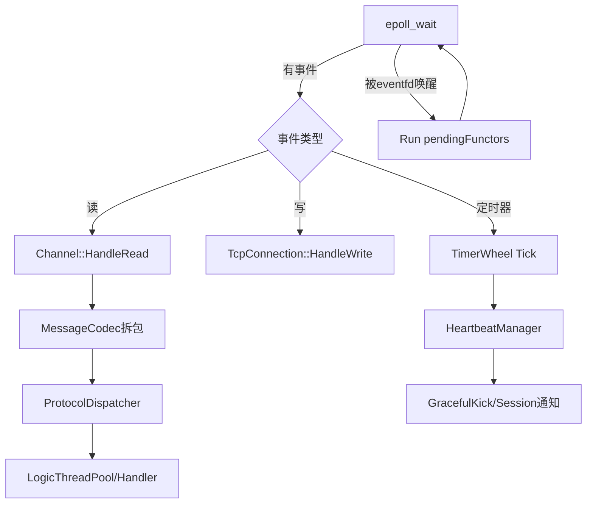
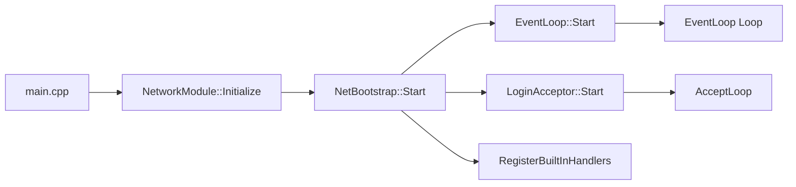
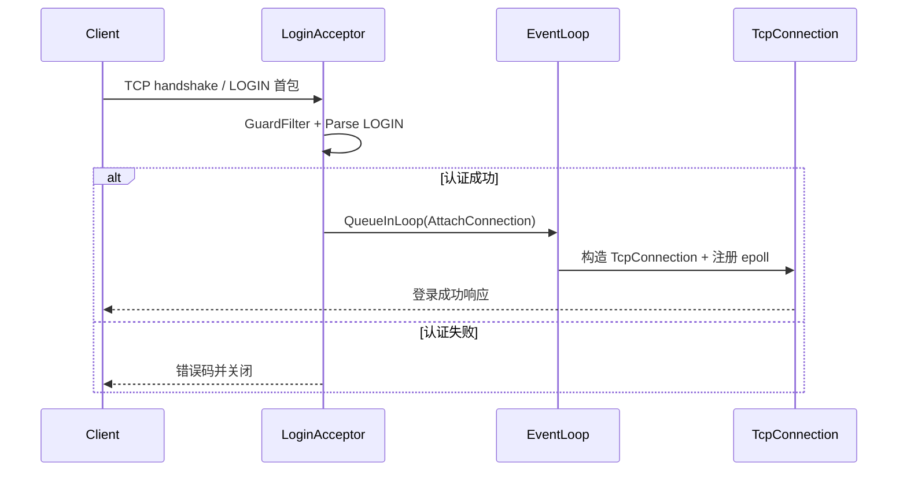

# WebGame
简易 web 游戏 & 数据原型

## 配置编辑器（Skills / Characters / Equipments）
- 位置：`web/config-editor/index.html`
- 打开方式：直接双击或通过静态服务器打开即可；全部逻辑在前端完成，无需后端。
- 核心流程：
	1. `导入 JSON`：选择现有配置文件（需包含 `skills` / `characters` / `equipments` 数组）。
	2. 左侧列表查看 / 选择条目，右侧表单实时编辑；技能可增删多条效果（目标、效果、数值表达式等）。
	3. `导出当前配置`：生成带缩进的 JSON 文件，可直接回写到游戏数据目录。

### JSON 结构预览
```json
{
	"meta": {
		"version": 1,
		"updatedAt": "2026-02-08T00:00:00.000Z"
	},
	"skills": [
		{
			"id": 1001,
			"name": "烈斩",
			"description": "对敌方单体造成伤害",
			"trigger": "NORMAL_ATTACK",
			"effects": [
				{
					"target": "ENEMY_SINGLE",
					"effect": "DAMAGE",
					"valueExpr": {
						"source": "ATK",
						"owner": "CASTER",
						"scale": "PERCENT",
						"value": 1600
					},
					"duration": 0,
					"chance": 100,
					"canOverlay": false
				}
			]
		}
	],
	"characters": [
		{
			"id": 2001,
			"name": "赵云",
			"baseName": "子龙",
			"relId": 2002,
			"quality": "ORANGE",
			"position": "ASSASSIN",
			"skillIds": [1001, 1201]
		}
	],
	"equipments": [
		{
			"id": 3001,
			"name": "龙胆枪",
			"type": "WEAPON",
			"quality": "RED",
			"skillId": 1301,
			"setId": 30,
			"baseAttrs": {
				"hp": 0,
				"maxHp": 0,
				"atk": 880,
				"def": 120,
				"speed": 40,
				"critRate": 15,
				"critDamage": 40,
				"hitRate": 5,
				"dodgeRate": 0
			}
		}
	]
}
```

> 备注：`value` 在 `PERCENT` 模式下使用万分比（示例 1600 = 16%）。编辑器会保留未识别字段，导出后可继续手动扩展。

### 运行期加载 JSON 配置
`SkillConfig`、`CharacterConfig`、`ItemConfig` 现在都支持直接读取 JSON 文件：

```cpp
#include "SkillConfig.h"
#include "CharacterConfig.h"
#include "ItemConfig.h"

void LoadGameData()
{
	std::string err;
	SkillConfig::instance().loadFromFile("data/config/game-data.json", &err);
	CharacterConfig::instance().loadFromFile("data/config/game-data.json", &err);
	ItemConfig::instance().loadFromFile("data/config/game-data.json", &err);
	if (!err.empty()) {
		LOG_WARN("Config warnings: %s", err.c_str());
	}
}
```

- 可以将技能、武将、装备定义放在同一个 JSON 中，或拆成多个文件后自行组合成 `nlohmann::json` 传入 `loadFromJson`。
- `loadFromFile` 内部使用 `nlohmann::json`，确保 `lib/json.hpp` 已包含在工程中。
- 所有配置都会在加载前自动 `clear()`，方便热更新；若需要增量更新，可手动调用 `reg()`。


# WebGame 模块设计

## 0. 设计目标
- 提供可横向扩展的事件驱动服务器内核，优先保证登录链路与战斗/互动逻辑的实时性。
- 通过集中式配置与热更新能力，使策划配置和前端协议保持一致。
- 构建统一的经济系统（物品、货币、商场、背包），确保事务一致性与可追溯性。
- 模块拆分清晰，关键节点具备可观测性（日志、指标、告警）。

## 1. 数据配置模块（DataConfig）
**职责**
- 启动时扫描 `src/data/**` 与策划产出目录，解析 JSON 表，生成内存结构和派生索引。
- 对外暴露只读查询接口（如 `GetItemTemplate(id)`、`GetShopShelf(shopId)`）。
- 支持热加载：在不重启 EventLoop 的情况下替换配置并通知依赖模块。

**关键技术点**
- 统一使用 `lib/json.hpp`（nlohmann::json）与 JSON Schema 校验器，启动即验证字段、类型、范围。
- 配置版本号 + 校验摘要（SHA256），通过 `ConfigRegistry` 记录，结合 inotify/文件轮询实现热更新。
- 双缓冲缓存：解析到新缓冲后用 `std::atomic<std::shared_ptr<const ConfigSnapshot>>` 无锁切换，保障查询零停顿。

**运行流程**
1. `ConfigLoader` 收集配置文件 -> 解析 -> 结构化（含索引表、随机掉落表等）。
2. 构造 `ConfigSnapshot`，计算版本摘要，写 `log/config.log`。
3. 通过观察者模式通知 `ItemService`、`ShopService` 等刷新引用。

## 2. 网络通信与 EventLoop 模块
### 2.1 分层结构
- **接入层（LoginAcceptor + GuardFilter）**：专职监听登录端口，负责 SYN flood 防护、TLS/密钥协商、白名单/黑名单判定以及限流。失败直接 `shutdown()`，成功的 fd 和初始 `ClientContext` 交给 AuthPipeline。
- **认证层（AuthPipeline + LoginWorkerPool）**：使用轻量工作线程解析首包、校验账号/签名，认证通过后调用 EventLoop 的线程安全接口注册客户端；失败回复错误码并记录安全日志。
- **事件循环层（EventLoop + Poller + Channel）**：主线程或线程池负责 epoll 监听、协议解包、逻辑派发、心跳/超时等定时任务。
- **业务派发层（ProtocolDispatcher + LogicThreadPool）**：根据 `msgId` 将消息分发到战斗、经济、聊天等后端服务或线程池；支持背压和优先级队列。
- **管理平面（ConnectProc HTTP 网关 + NetDiag）**：保留现有 `ConnectProc` 供运营/GM/健康检查调用；`NetDiag` 汇总指标并暴露到 Prometheus。

### 2.2 核心类与职责
- `NetConfig`：集中记录监听端口、epoll 触发模式、最大连接数、PROTO 协议长度限制等，提供热更新回调。
- `NetBootstrap`：读取 `NetConfig`，初始化 `LoginAcceptor`、`EventLoop`、`LogicThreadPool` 并完成依赖注入，是网络子系统的入口。
- `LoginAcceptor`：封装 `socket/bind/listen` 与 `accept4` 循环，挂载 `GuardFilter`（IP 黑名单、连接频率、TCP FastOpen）。
- `AuthPipeline`：解析首包（可选 HTTP/WebSocket/自定义二进制），调用 `AuthService`，成功后构造 `ClientContext` 并通过 `EventLoop::runInLoop` 注册；支持 `eventfd` 唤醒以跨线程传递。
- `EventLoop`：维护 `Poller`（epoll）与 `pendingFunctors_`，负责 IO 事件分发、执行来自外部线程的任务、驱动 `TimerQueue/TimerWheel`。
- `Channel`：对应单个 fd 的事件订阅体，保存读写回调和关注的 epoll 事件，支持边缘触发自动重新注册。
- `TcpConnection`：面向上层提供发送、半关闭、踢线等操作，内部组合 `Channel` 与 `ClientContext`。
- `ClientContext`：记录连接状态机（`Handshaking -> Authed -> InGame -> Closing`）、序列号、心跳戳、SessionId，提供线程安全的属性读写接口。
- `MessageCodec`：完成粘包拆包、压缩/加密、CRC 校验，支持 JSON 和二进制 PB 两种协议头，通过策略模式选择实现。
- `ProtocolDispatcher`：注册 `msgId -> Handler`，支持版本协商；陌生包写入 `NET` 日志并回调安全模块。
- `HeartbeatManager`：挂在 `TimerWheel` 上，定期扫描 `ClientContext`，超时后通过 `TcpConnection::ForceClose()` 清理。
- `OutboundQueue`：为每个连接维护待发送队列，结合 `writev` 与发送水位回调实现限速与背压。
- `NetDiag`：收集 QPS、平均延迟、发送/接收字节、背压水位，暴露 `/net/metrics` 接口供 `ConnectProc` 和运维查看。

### 2.3 关键流程
**连接接入**
1. `LoginAcceptor` 通过 epoll 或阻塞 `accept4` 接收新连接，立即交给 `GuardFilter` 做 SYN Cookie、IP 频控。
2. 通过 `AuthPipeline::HandleNewFd(fd)` 读取首包，校验签名/版本/区服，并调用 `AuthService::Verify`。
3. 成功后将 `std::shared_ptr<ClientContext>` 与 `TcpConnection` 封装成 `Functor`，调用 `EventLoop::queueInLoop` 写入 `pendingFunctors_`；失败直接写回错误码并 `close(fd)`。

**消息收发**
1. EventLoop epoll 触发 `EPOLLIN`，`Channel` 调用 `TcpConnection::HandleRead()`，由 `MessageCodec` 负责拆包。
2. 解析出 `Packet` 后交给 `ProtocolDispatcher::Dispatch(packet, ctx)`，根据 `msgId` 选择 handler 或放入 `LogicThreadPool` 异步执行。
3. Handler 需要写回响应时调用 `TcpConnection::Send(buffer)`；若不在 EventLoop 线程，则通过 `runInLoop` 投递写操作。

**心跳与超时**
1. `HeartbeatManager` 在 `TimerWheel` 中注册每个连接的下次检查时间。
2. EventLoop tick 时触发过期回调，先尝试下发 `PING`，再超过阈值执行 `GracefulKick` 并通知 `SessionStore`。

**广播/推送**
- `SessionBus` 可向 `EventLoop` 提交 `FanoutTask`，由 `EventLoop` 批量遍历 `ClientContext`，通过 `OutboundQueue` 保证推送不会瞬间打满发送缓冲。

### 2.4 逻辑连接点
- `LoginAcceptor -> AuthService -> EventLoop`：首包握手到加入主循环的链路，使用 `eventfd` 唤醒保障跨线程一致性。
- `EventLoop -> SessionStore`：登录成功后更新 Session，心跳/断线事件同步到会话模块，便于顶号与跨服联动。
- `ProtocolDispatcher -> LogicThreadPool`：网络线程只做解包和转发，重型逻辑由业务线程执行；使用 `TaskContext` 带上 `ClientContext` 以回写结果。
- `EventLoop/HeartbeatManager -> Economy & Gameplay`：掉线、重连、超时会触发事件，战斗或经济模块可订阅，确保状态一致。
- `NetDiag -> LogM/StatsExporter`：网络层指标、慢包、异常流量统一收敛到日志与指标系统，便于与 5 章的运维能力打通。

> 现有 `ConnectProc` 仍用于 Web/GM API；若要无缝迁移，可让其复用 `ProtocolDispatcher` 的 handler 注册体系，保证 HTTP 与二进制协议行为一致。

### 2.5 EventLoop 内部机制
- **跨线程投递**：`EventLoop::runInLoop` 判断当前线程，若是 Loop 线程直接执行；否则交给 `queueInLoop` 压入 `pendingFunctors_` 并写 `eventfd` 唤醒。该设计来自 `GameServers/docx/EventLoop模块设计.md`，已验证在高并发下延迟稳定在微秒级。
- **唤醒流程**：构造阶段创建 `eventfd` 与 `wakeupClient`（包裹在 `Channel` 中）。其他线程 `write(eventfd)` 唤醒 epoll；Loop 线程在 `handleRead` 里 `read(eventfd)` 清除状态后批量执行 `pendingFunctors_`。
- **定时任务**：Loop 驱动 `TimerWheel`，tick 中一并处理心跳、延迟写回、Idle 连接回收，确保单线程无锁。
- **伪代码**：

```cpp
void EventLoop::runInLoop(Functor cb) {
	if (isInLoopThread()) {
		cb();
	} else {
		queueInLoop(std::move(cb));
	}
}

void EventLoop::queueInLoop(Functor cb) {
	{
		std::lock_guard<std::mutex> lock(mutex_);
		pendingFunctors_.push_back(std::move(cb));
	}
	wakeup(); // eventfd 写入 1，触发 epoll
}
```

### 2.6 登录链路时序图



### 2.7 EventLoop 主循环流程



## 3. 会话与玩家上下文模块
**职责**
- 维护 `PlayerSession`（账号、角色、权限、心跳时间戳、所在分区）。
- 提供分布式 Session 表：本服内存 + 可选 Redis 缓存，实现快速顶号和多终端互斥。
- 向业务逻辑暴露 `SessionBus`，用于广播踢下线、货币变更等事件。

**关键技术点**
- `SessionStore` 采用读写锁 + LRU，热点数据常驻内存；持久化通过 MySQL/Redis。
- 心跳检测由 EventLoop 定时任务驱动，超过阈值触发 `GracefulKick`。
- 玩家上下文与背包/任务等子系统以 `std::shared_ptr<PlayerContext>` 共享，减少复制。

## 4. 物品-货币-商场-背包模块
### 4.1 Item & Currency Catalog
- `ItemTemplate`、`CurrencyTemplate` 来自 DataConfig，支持多标签（稀有度、绑定属性）。
- 构建只读 `ItemIndex`（根据类型/用途分层），方便商场与掉落系统查询。

**关键技术点**
- 模板结构使用 `constexpr`/`enum class` 定义字段，配合 `flat_map` 保证查询性能。
- 通过 `RuleEngine`（表达式解析，如 `requireLevel >= 30 && vip > 1`）描述装备限制。

### 4.2 Inventory Service（背包）
- 为玩家维护多页背包、仓库、临时包；支持栈叠、锁定、排序。
- 暴露 `TryConsumeItems`、`GrantItems`、`QuerySlots` 等接口给战斗/任务模块。

**关键技术点**
- 使用 `CommandJournal` 记录变更，失败可回滚；最终变更异步刷写数据库。
- 物品堆叠采用 `SlotView + SegmentTree` 快速定位空位。
- 与网络层 decoupled：EventLoop 只投递指令，背包逻辑在 Logic 线程池执行，完成后回推响应。

### 4.3 Shop Service（商场）
- 根据运营配置动态刷新货架，支持限购、折扣、轮换、礼包。
- 接入支付网关/虚拟币系统，统一走 `TradeService::BeginOrder()`。

**关键技术点**
- 多货币结算（绑定/不绑定钻石、积分）通过 `PricingGraph` 计算最优组合。
- 使用 Redis 原子 LUA 或数据库行锁实现限购计数，杜绝超卖。
- 后台灰度：`ShopRule` 可绑定账号标签，配置实时下发。

### 4.4 Economy Consistency（货币一致性）
- 所有货币、物品变动统一走 `EconomyPipeline` 事件流，便于审计。
- `EconomyLedger` 按照 `(playerId, assetType)` 建立双 entry 账本（借/贷）。

**关键技术点**
- 事件持久化使用 `Kafka/ZeroMQ` 可插拔接口；默认落地本地顺序日志并由异步任务入库。
- 提供 GM 查询接口，可追溯任意交易链路。

## 5. 运维与可观测性
- `LogM`：区分 `NET`, `CONFIG`, `ECONOMY` 等 channel，结合 traceId 形成链路。
- 指标：EventLoop backlog、JSON 热更耗时、交易失败率等通过 `StatsExporter` 上报 Prometheus。
- 压测工具：保留 `test/` 目录下的客户端脚本，CI 自动执行登录 + 商城购买回归。

---
后续若新增战斗、任务体系，可在 EventLoop 上再挂逻辑线程池，通过 `SessionBus` 与现有模块解耦，实现渐进式扩展。


# 网络模块文件说明

> 该目录实现了模块设计文档中提出的 EventLoop/登录接入/协议派发架构。下面按文件逐一说明职责、主要接口以及与其他组件的关系。

| 文件 | 作用 | 关键点 |
| --- | --- | --- |
| `NetConfig.h/.cpp` | 定义并加载网络层的运行参数（监听地址、端口、边缘触发开关、最大连接数、登录线程池大小、心跳超时等）。 | `NetConfig::LoadDefault()` 提供默认值，后续可扩展为读取配置文件/环境变量。所有核心对象通过引用同一份配置来保持一致。 |
| `ClientContext.h` | 描述单个客户端在服务器侧的状态（账号、token、远端地址、状态机、心跳时间戳以及自定义属性表）。 | 提供 `TransitTo`/`TouchHeartbeat` 等接口，保证 EventLoop 与业务线程都能察看一致的会话元数据。 |
| `MessageCodec.h/.cpp` | 简单的文本协议编解码器，用 `CMD payload\n` 形式表示一条消息，负责拆包、去空白以及编码响应。 | EventLoop 的 `TcpConnection` 在读到数据后交给 `MessageCodec::Decode` 获得 `Packet` 列表，写回时调用 `Encode`。 |
| `ProtocolDispatcher.h/.cpp` | 将 `Packet.command` 映射到具体处理器。 | 内部用互斥保护 `handlers_` 表，可注册 `PING`/`ECHO` 等命令，未知命令会返回 `ERR unknown command` 并写日志。 |
| `NetDiag.h` | 采集网络运行数据（接受/拒绝连接数、入站/出站消息数）。 | LoginAcceptor、TcpConnection、EventLoop 会在关键路径调用递增方法，便于之后接入监控。 |
| `HeartbeatManager.h` | 包装心跳超时配置并提供扫描入口。 | EventLoop 在 `ScanHeartbeats` 中使用它驱动心跳检查/踢线逻辑。 |
| `TcpConnection.h/.cpp` | 抽象单个 TCP 连接，封装 epoll 事件处理、读写缓冲、消息解码、发送队列、关闭流程以及连接诊断。 | 当 `OnEvent` 收到 `EPOLLIN`/`EPOLLOUT` 时分别触发 `HandleReadable`/`HandleWritable`；发送方如果不在 Loop 线程，会通过 `EventLoop::RunInLoop` 保证线程安全。 |
| `EventLoop.h/.cpp` | 事件驱动内核：维护 epoll、eventfd 唤醒、任务队列、连接表以及心跳扫描。 | `RunInLoop`/`QueueInLoop` 对外暴露跨线程投递；`AttachConnection` 将新 fd 注册到 epoll；`Loop()` 中统一调度 IO、定时任务和挂起 Functor。 |
| `LoginAcceptor.h/.cpp` | 独立线程监听登录端口，做 GuardFilter、首包读取/校验以及 ClientContext 构造，成功后把 fd 投递到 EventLoop。 | 首包遵循 `LOGIN <account> <token>` 行协议，可在此接入真正的鉴权逻辑；失败/黑名单会直接关闭连接并统计拒绝次数。 |
| `NetBootstrap` | 网络模块的统一入口，串联配置、事件循环、登录接入与内建协议。 | 在 `RegisterBuiltInHandlers()` 中注册基础命令（PING/ECHO/QUIT）；`Start()` 顺序拉起 EventLoop 和 LoginAcceptor，`Stop()` 负责按反向顺序关闭。 |
| `NetworkModule.h/.cpp` | 为 `main.cpp` 提供 `InitializeNetwork()` / `ShutdownNetwork()` 封装，管理 `NetBootstrap` 的单例生命周期。 | 方便游戏服在不同阶段初始化/销毁网络层，也为未来热重启/重载留出入口。 |
| `ConnectProc.h/.cpp` | 旧版的 HTTP/JSON 接入实现，仍保留供 GM/工具链复用。 | 如果需要继续使用，可将其改造成独立目标或复用 `ProtocolDispatcher` 的 handler 注册，以保持跟新版网络栈的一致性。 |

## 目录关系图
```
NetBootstrap
 ├── NetConfig / NetDiag
 ├── EventLoop
 │    ├── TcpConnection
 │    │     └── MessageCodec +  + ClientContext
 │    └── HeartbeatManager
 └── LoginAcceptor (→ ClientContext)
```

> 若新增协议或监控功能，建议：在 `ProtocolDispatcher` 注册 handler，在 `NetDiag` 增加指标，并在 `README` 中同步说明，保持文档与实现一致。


## 运行流程

### 1. 服务器启动路径
1. `main.cpp` 调用 `webgame::net::InitializeNetwork()`。
2. `NetworkModule` 构造 `NetBootstrap`，并加载 `NetConfig` 默认值（监听地址/端口、心跳阈值等）。
3. `NetBootstrap::Start()` 顺序执行：
    - 创建 `EventLoop`，初始化 epoll 与 eventfd 并启动事件线程；
    - 创建 `LoginAcceptor` 并在独立线程上进入 `accept4` 循环；
    - 在 `RegisterBuiltInHandlers()` 中向 `ProtocolDispatcher` 注册系统命令（PING/ECHO/QUIT）。
4. 各组件启动成功后返回 `true`，主线程进入阻塞循环等待退出信号；关闭时反向依次调用 `Stop()`，确保先停接入再停 EventLoop。



### 2. 登录请求生命周期
1. 客户端向监听端口发起 TCP/TLS 连接，`LoginAcceptor` 快速完成 `accept4`。
2. `GuardFilter` 根据 IP/连接速率做初筛，不合格直接关闭（`diag_.IncRejected`）。
3. 通过阻塞读取拿到首包字符串，解析 `LOGIN <account> <token>` 并构造 `ClientContext`，填充远端地址、账号、token、初始状态。
4. 调用 `EventLoop::QueueInLoop` 投递一个 `AttachConnection` 任务：
    - EventLoop 唤醒后将 fd 设为非阻塞并注册到 epoll；
    - 创建 `TcpConnection`，绑定 `ClientContext` 与 `ProtocolDispatcher`；
    - 连接状态切换为 `Authed`，发送登录成功响应（可在后续 handler 中完成）。
5. 登录失败（首包格式错误、鉴权失败等）时，在 `LoginAcceptor` 内回复错误码并立即 `shutdown(fd)`。



### 3. 已连接会话与业务交互
1. **接收**：
    - epoll 告知 fd 可读时，`TcpConnection::HandleReadable` 将字节追加到 `inboundBuffer`；
    - `MessageCodec::Decode` 拆成 `Packet` 列表并更新 `ClientContext` 心跳时间戳；
    - 每个 `Packet` 交由 `ProtocolDispatcher::Dispatch`，再根据 `command` 调用注册的 handler（未来可将耗时操作投递到逻辑线程池）。
2. **执行业务**：
    - Handler 可以直接使用 `ClientContext` 查询账号信息，将结果写回 `TcpConnection::Send()`；
    - 若需要访问数据库或跨线程执行，handler 负责把回调重新 `RunInLoop`，保持网络线程无阻塞。
3. **发送**：
    - `Send()` 会把数据追加到 `outboundQueue`，必要时注册 `EPOLLOUT`，待 socket 可写时批量 `writev`。
4. **可观测性**：
    - `NetDiag` 在消息入站/出站、连接接入/关闭等节点递增计数；
    - `HeartbeatManager` 定期扫描 `ClientContext::lastHeartbeat`，超时则触发 `GracefulKick` 并更新会话状态。
5. **HTTP/工具交互**：如需继续支持 `ConnectProc` 提供的 REST 接口，可在同一进程启动该模块，它与 EventLoop 并行运行，并可通过共享的业务 handler 或 `SessionStore` 与游戏会话互通。

总结来说：服务启动先铺好 EventLoop + LoginAcceptor 骨架；登录请求在接入层过滤并挂到 EventLoop；一旦进入主循环，所有后续协议都由 `TcpConnection → MessageCodec → ProtocolDispatcher` 链路处理，确保逻辑线程只关注业务而无需接触底层 IO。
