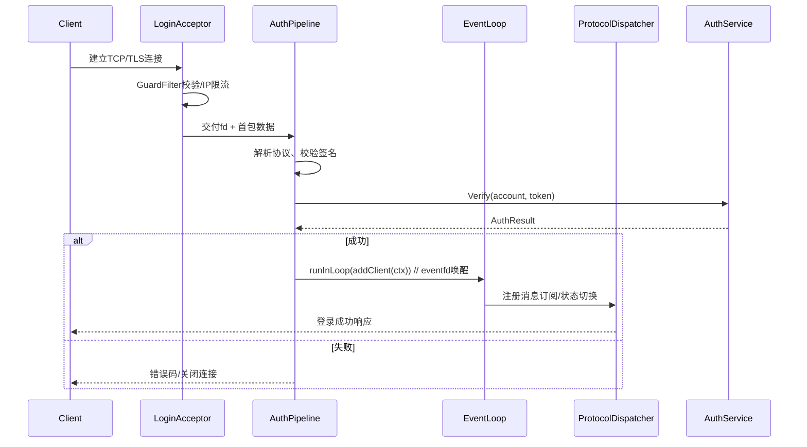
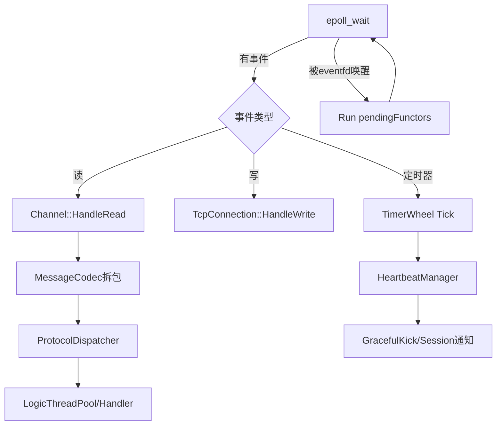

# WebGame 模块设计

## 0. 设计目标
- 提供可横向扩展的事件驱动服务器内核，优先保证登录链路与战斗/互动逻辑的实时性。
- 通过集中式配置与热更新能力，使策划配置和前端协议保持一致。
- 构建统一的经济系统（物品、货币、商场、背包），确保事务一致性与可追溯性。
- 模块拆分清晰，关键节点具备可观测性（日志、指标、告警）。

## 1. 数据配置模块（DataConfig）
**职责**
- 启动时扫描 `src/data/**` 与策划产出目录，解析 JSON 表，生成内存结构和派生索引。
- 对外暴露只读查询接口（如 `GetItemTemplate(id)`、`GetShopShelf(shopId)`）。
- 支持热加载：在不重启 EventLoop 的情况下替换配置并通知依赖模块。

**关键技术点**
- 统一使用 `lib/json.hpp`（nlohmann::json）与 JSON Schema 校验器，启动即验证字段、类型、范围。
- 配置版本号 + 校验摘要（SHA256），通过 `ConfigRegistry` 记录，结合 inotify/文件轮询实现热更新。
- 双缓冲缓存：解析到新缓冲后用 `std::atomic<std::shared_ptr<const ConfigSnapshot>>` 无锁切换，保障查询零停顿。

**运行流程**
1. `ConfigLoader` 收集配置文件 -> 解析 -> 结构化（含索引表、随机掉落表等）。
2. 构造 `ConfigSnapshot`，计算版本摘要，写 `log/config.log`。
3. 通过观察者模式通知 `ItemService`、`ShopService` 等刷新引用。

## 2. 网络通信与 EventLoop 模块
### 2.1 分层结构
- **接入层（LoginAcceptor + GuardFilter）**：专职监听登录端口，负责 SYN flood 防护、TLS/密钥协商、白名单/黑名单判定以及限流。失败直接 `shutdown()`，成功的 fd 和初始 `ClientContext` 交给 AuthPipeline。
- **认证层（AuthPipeline + LoginWorkerPool）**：使用轻量工作线程解析首包、校验账号/签名，认证通过后调用 EventLoop 的线程安全接口注册客户端；失败回复错误码并记录安全日志。
- **事件循环层（EventLoop + Poller + Channel）**：主线程或线程池负责 epoll 监听、协议解包、逻辑派发、心跳/超时等定时任务。
- **业务派发层（ProtocolDispatcher + LogicThreadPool）**：根据 `msgId` 将消息分发到战斗、经济、聊天等后端服务或线程池；支持背压和优先级队列。
- **管理平面（ConnectProc HTTP 网关 + NetDiag）**：保留现有 `ConnectProc` 供运营/GM/健康检查调用；`NetDiag` 汇总指标并暴露到 Prometheus。

### 2.2 核心类与职责
- `NetConfig`：集中记录监听端口、epoll 触发模式、最大连接数、PROTO 协议长度限制等，提供热更新回调。
- `NetBootstrap`：读取 `NetConfig`，初始化 `LoginAcceptor`、`EventLoop`、`LogicThreadPool` 并完成依赖注入，是网络子系统的入口。
- `LoginAcceptor`：封装 `socket/bind/listen` 与 `accept4` 循环，挂载 `GuardFilter`（IP 黑名单、连接频率、TCP FastOpen）。
- `AuthPipeline`：解析首包（可选 HTTP/WebSocket/自定义二进制），调用 `AuthService`，成功后构造 `ClientContext` 并通过 `EventLoop::runInLoop` 注册；支持 `eventfd` 唤醒以跨线程传递。
- `EventLoop`：维护 `Poller`（epoll）与 `pendingFunctors_`，负责 IO 事件分发、执行来自外部线程的任务、驱动 `TimerQueue/TimerWheel`。
- `Channel`：对应单个 fd 的事件订阅体，保存读写回调和关注的 epoll 事件，支持边缘触发自动重新注册。
- `TcpConnection`：面向上层提供发送、半关闭、踢线等操作，内部组合 `Channel` 与 `ClientContext`。
- `ClientContext`：记录连接状态机（`Handshaking -> Authed -> InGame -> Closing`）、序列号、心跳戳、SessionId，提供线程安全的属性读写接口。
- `MessageCodec`：完成粘包拆包、压缩/加密、CRC 校验，支持 JSON 和二进制 PB 两种协议头，通过策略模式选择实现。
- `ProtocolDispatcher`：注册 `msgId -> Handler`，支持版本协商；陌生包写入 `NET` 日志并回调安全模块。
- `HeartbeatManager`：挂在 `TimerWheel` 上，定期扫描 `ClientContext`，超时后通过 `TcpConnection::ForceClose()` 清理。
- `OutboundQueue`：为每个连接维护待发送队列，结合 `writev` 与发送水位回调实现限速与背压。
- `NetDiag`：收集 QPS、平均延迟、发送/接收字节、背压水位，暴露 `/net/metrics` 接口供 `ConnectProc` 和运维查看。

### 2.3 关键流程
**连接接入**
1. `LoginAcceptor` 通过 epoll 或阻塞 `accept4` 接收新连接，立即交给 `GuardFilter` 做 SYN Cookie、IP 频控。
2. 通过 `AuthPipeline::HandleNewFd(fd)` 读取首包，校验签名/版本/区服，并调用 `AuthService::Verify`。
3. 成功后将 `std::shared_ptr<ClientContext>` 与 `TcpConnection` 封装成 `Functor`，调用 `EventLoop::queueInLoop` 写入 `pendingFunctors_`；失败直接写回错误码并 `close(fd)`。

**消息收发**
1. EventLoop epoll 触发 `EPOLLIN`，`Channel` 调用 `TcpConnection::HandleRead()`，由 `MessageCodec` 负责拆包。
2. 解析出 `Packet` 后交给 `ProtocolDispatcher::Dispatch(packet, ctx)`，根据 `msgId` 选择 handler 或放入 `LogicThreadPool` 异步执行。
3. Handler 需要写回响应时调用 `TcpConnection::Send(buffer)`；若不在 EventLoop 线程，则通过 `runInLoop` 投递写操作。

**心跳与超时**
1. `HeartbeatManager` 在 `TimerWheel` 中注册每个连接的下次检查时间。
2. EventLoop tick 时触发过期回调，先尝试下发 `PING`，再超过阈值执行 `GracefulKick` 并通知 `SessionStore`。

**广播/推送**
- `SessionBus` 可向 `EventLoop` 提交 `FanoutTask`，由 `EventLoop` 批量遍历 `ClientContext`，通过 `OutboundQueue` 保证推送不会瞬间打满发送缓冲。

### 2.4 逻辑连接点
- `LoginAcceptor -> AuthService -> EventLoop`：首包握手到加入主循环的链路，使用 `eventfd` 唤醒保障跨线程一致性。
- `EventLoop -> SessionStore`：登录成功后更新 Session，心跳/断线事件同步到会话模块，便于顶号与跨服联动。
- `ProtocolDispatcher -> LogicThreadPool`：网络线程只做解包和转发，重型逻辑由业务线程执行；使用 `TaskContext` 带上 `ClientContext` 以回写结果。
- `EventLoop/HeartbeatManager -> Economy & Gameplay`：掉线、重连、超时会触发事件，战斗或经济模块可订阅，确保状态一致。
- `NetDiag -> LogM/StatsExporter`：网络层指标、慢包、异常流量统一收敛到日志与指标系统，便于与 5 章的运维能力打通。

> 现有 `ConnectProc` 仍用于 Web/GM API；若要无缝迁移，可让其复用 `ProtocolDispatcher` 的 handler 注册体系，保证 HTTP 与二进制协议行为一致。

### 2.5 EventLoop 内部机制
- **跨线程投递**：`EventLoop::runInLoop` 判断当前线程，若是 Loop 线程直接执行；否则交给 `queueInLoop` 压入 `pendingFunctors_` 并写 `eventfd` 唤醒。该设计来自 `GameServers/docx/EventLoop模块设计.md`，已验证在高并发下延迟稳定在微秒级。
- **唤醒流程**：构造阶段创建 `eventfd` 与 `wakeupClient`（包裹在 `Channel` 中）。其他线程 `write(eventfd)` 唤醒 epoll；Loop 线程在 `handleRead` 里 `read(eventfd)` 清除状态后批量执行 `pendingFunctors_`。
- **定时任务**：Loop 驱动 `TimerWheel`，tick 中一并处理心跳、延迟写回、Idle 连接回收，确保单线程无锁。
- **伪代码**：

```cpp
void EventLoop::runInLoop(Functor cb) {
	if (isInLoopThread()) {
		cb();
	} else {
		queueInLoop(std::move(cb));
	}
}

void EventLoop::queueInLoop(Functor cb) {
	{
		std::lock_guard<std::mutex> lock(mutex_);
		pendingFunctors_.push_back(std::move(cb));
	}
	wakeup(); // eventfd 写入 1，触发 epoll
}
```

### 2.6 登录链路时序图



### 2.7 EventLoop 主循环流程



### 2.8 业务交互 - 发送流程

**流程说明**
1. 业务 `Handler`（运行在 `LogicThreadPool`）完成逻辑处理，构造 `GameResponse` 并调用 `TcpConnection::Send()`。
2. 若当前线程不是 `EventLoop`，`Send()` 会通过 `EventLoop::runInLoop` 投递写操作，确保真正的写入逻辑仍在网络线程执行。
3. `TcpConnection::sendInLoop` 将序列化后的 `Packet` 推入 `OutboundQueue`，尝试直接 `writev` 到内核发送缓冲；若一次写不完，则记录待发字节并打开 `Channel` 的 `EPOLLOUT` 关注。
4. 当内核通知可写时，`Channel::HandleWrite` 继续从 `OutboundQueue` 取包发送；发送完成且低于水位线时触发 `OnLowWatermark`，唤醒等待写入的业务方或继续投递下一批任务。
5. 客户端收到响应，若需要继续交互，再次通过 `ProtocolDispatcher` -> `LogicThreadPool` 形成闭环。

```mermaid
flowchart LR
	H[LogicThreadPool Handler] --> RB[MessageCodec::Encode/GameResponse]
	RB --> SL[TcpConnection::Send]
	SL -->|跨线程| RIL[EventLoop::runInLoop]
	RIL --> SIL[sendInLoop]
	SIL --> OQ[OutboundQueue
(per-connection)]
	OQ -->|writev| OS[TCP Send Buffer]
	OS -->|ACK/完成| CH[Channel::HandleWrite]
	CH -->|低水位| BK[Backpressure Callback]
	OS --> C[Client]
```

## 3. 会话与玩家上下文模块
**职责**
- 维护 `PlayerSession`（账号、角色、权限、心跳时间戳、所在分区）。
- 提供分布式 Session 表：本服内存 + 可选 Redis 缓存，实现快速顶号和多终端互斥。
- 向业务逻辑暴露 `SessionBus`，用于广播踢下线、货币变更等事件。

**关键技术点**
- `SessionStore` 采用读写锁 + LRU，热点数据常驻内存；持久化通过 MySQL/Redis。
- 心跳检测由 EventLoop 定时任务驱动，超过阈值触发 `GracefulKick`。
- 玩家上下文与背包/任务等子系统以 `std::shared_ptr<PlayerContext>` 共享，减少复制。

## 4. 物品-货币-商场-背包模块
### 4.1 Item & Currency Catalog
- `ItemTemplate`、`CurrencyTemplate` 来自 DataConfig，支持多标签（稀有度、绑定属性）。
- 构建只读 `ItemIndex`（根据类型/用途分层），方便商场与掉落系统查询。

**关键技术点**
- 模板结构使用 `constexpr`/`enum class` 定义字段，配合 `flat_map` 保证查询性能。
- 通过 `RuleEngine`（表达式解析，如 `requireLevel >= 30 && vip > 1`）描述装备限制。

### 4.2 Inventory Service（背包）
- 为玩家维护多页背包、仓库、临时包；支持栈叠、锁定、排序。
- 暴露 `TryConsumeItems`、`GrantItems`、`QuerySlots` 等接口给战斗/任务模块。

**关键技术点**
- 使用 `CommandJournal` 记录变更，失败可回滚；最终变更异步刷写数据库。
- 物品堆叠采用 `SlotView + SegmentTree` 快速定位空位。
- 与网络层 decoupled：EventLoop 只投递指令，背包逻辑在 Logic 线程池执行，完成后回推响应。

### 4.3 Shop Service（商场）
- 根据运营配置动态刷新货架，支持限购、折扣、轮换、礼包。
- 接入支付网关/虚拟币系统，统一走 `TradeService::BeginOrder()`。

**关键技术点**
- 多货币结算（绑定/不绑定钻石、积分）通过 `PricingGraph` 计算最优组合。
- 使用 Redis 原子 LUA 或数据库行锁实现限购计数，杜绝超卖。
- 后台灰度：`ShopRule` 可绑定账号标签，配置实时下发。

### 4.4 Economy Consistency（货币一致性）
- 所有货币、物品变动统一走 `EconomyPipeline` 事件流，便于审计。
- `EconomyLedger` 按照 `(playerId, assetType)` 建立双 entry 账本（借/贷）。

**关键技术点**
- 事件持久化使用 `Kafka/ZeroMQ` 可插拔接口；默认落地本地顺序日志并由异步任务入库。
- 提供 GM 查询接口，可追溯任意交易链路。

## 5. 运维与可观测性
- `LogM`：区分 `NET`, `CONFIG`, `ECONOMY` 等 channel，结合 traceId 形成链路。
- 指标：EventLoop backlog、JSON 热更耗时、交易失败率等通过 `StatsExporter` 上报 Prometheus。
- 压测工具：保留 `test/` 目录下的客户端脚本，CI 自动执行登录 + 商城购买回归。

---
后续若新增战斗、任务体系，可在 EventLoop 上再挂逻辑线程池，通过 `SessionBus` 与现有模块解耦，实现渐进式扩展。
