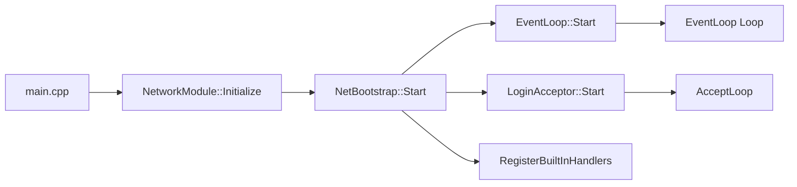
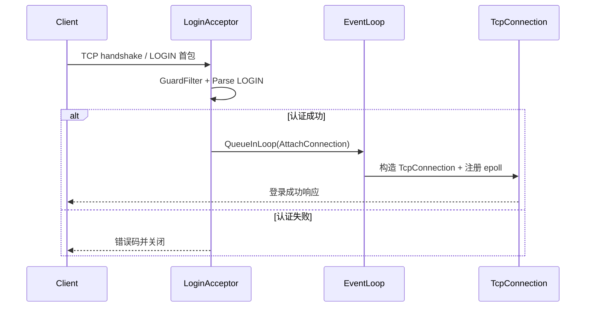

# 网络模块文件说明

> 该目录实现了模块设计文档中提出的 EventLoop/登录接入/协议派发架构。下面按文件逐一说明职责、主要接口以及与其他组件的关系。

| 文件 | 作用 | 关键点 |
| --- | --- | --- |
| `NetConfig.h/.cpp` | 定义并加载网络层的运行参数（监听地址、端口、边缘触发开关、最大连接数、登录线程池大小、心跳超时、IO 线程数等）。 | `NetConfig::LoadDefault()` 提供默认值，后续可扩展为读取配置文件/环境变量。所有核心对象通过引用同一份配置来保持一致。 |
| `ClientContext.h` | 描述单个客户端在服务器侧的状态（账号、token、远端地址、状态机、心跳时间戳以及自定义属性表）。 | 提供 `TransitTo`/`TouchHeartbeat` 等接口，保证 EventLoop 与业务线程都能察看一致的会话元数据。 |
| `MessageCodec.h/.cpp` | 简单的文本协议编解码器，用 `CMD payload\n` 形式表示一条消息，负责拆包、去空白以及编码响应。 | EventLoop 的 `TcpConnection` 在读到数据后交给 `MessageCodec::Decode` 获得 `Packet` 列表，写回时调用 `Encode`。 |
| `ProtocolDispatcher.h/.cpp` | 将 `Packet.command` 映射到具体处理器。 | 内部用互斥保护 `handlers_` 表，可注册 `PING`/`ECHO` 等命令，未知命令会返回 `ERR unknown command` 并写日志。 |
| `NetDiag.h` | 采集网络运行数据（接受/拒绝连接数、入站/出站消息数）。 | LoginAcceptor、TcpConnection、EventLoop 会在关键路径调用递增方法，便于之后接入监控。 |
| `HeartbeatManager.h` | 包装心跳超时配置并提供扫描入口。 | EventLoop 在 `ScanHeartbeats` 中使用它驱动心跳检查/踢线逻辑。 |
| `TcpConnection.h/.cpp` | 抽象单个 TCP 连接，封装 epoll 事件处理、读写缓冲、消息解码、发送队列、关闭流程以及连接诊断。 | 当 `OnEvent` 收到 `EPOLLIN`/`EPOLLOUT` 时分别触发 `HandleReadable`/`HandleWritable`；发送方如果不在 Loop 线程，会通过 `EventLoop::RunInLoop` 保证线程安全。 |
| `EventLoop.h/.cpp` | 事件驱动内核：维护 epoll、eventfd 唤醒、任务队列、连接表以及心跳扫描。 | `RunInLoop`/`QueueInLoop` 对外暴露跨线程投递；`AttachConnection` 将新 fd 注册到 epoll；`Loop()` 中统一调度 IO、定时任务和挂起 Functor。 |
| `EventLoopGroup.h/.cpp` | 管理多个 EventLoop 实例，按 `ioThreadCount` 启动线程池并提供 round-robin 的 `NextLoop()`。 | 供 `LoginAcceptor` 在认证成功后挑选目标 Loop，实现连接在多个 IO 线程之间的均衡分配，支持热停/重启。 |
| `LoginAcceptor.h/.cpp` | 独立线程监听登录端口，做 GuardFilter、首包读取/校验以及 ClientContext 构造，成功后把 fd 投递到 EventLoop。 | 首包遵循 `LOGIN <account> <token>` 行协议，可在此接入真正的鉴权逻辑；失败/黑名单会直接关闭连接并统计拒绝次数。 |
| `NetBootstrap.h/.cpp` | 网络模块的统一入口，串联配置、事件循环、登录接入与内建协议。 | 在 `RegisterBuiltInHandlers()` 中注册基础命令（PING/ECHO/QUIT）；`Start()` 顺序拉起 EventLoop 和 LoginAcceptor，`Stop()` 负责按反向顺序关闭。 |
| `NetworkModule.h/.cpp` | 为 `main.cpp` 提供 `InitializeNetwork()` / `ShutdownNetwork()` 封装，管理 `NetBootstrap` 的单例生命周期。 | 方便游戏服在不同阶段初始化/销毁网络层，也为未来热重启/重载留出入口。 |
| `ConnectProc.h/.cpp` | 旧版的 HTTP/JSON 接入实现，仍保留供 GM/工具链复用。 | 如果需要继续使用，可将其改造成独立目标或复用 `ProtocolDispatcher` 的 handler 注册，以保持跟新版网络栈的一致性。 |

## 目录关系图
```
NetBootstrap
 ├── NetConfig / NetDiag
 ├── EventLoop
 │    ├── TcpConnection
 │    │     └── MessageCodec + ProtocolDispatcher + ClientContext
 │    └── HeartbeatManager
 └── LoginAcceptor (→ ClientContext)
```

> 若新增协议或监控功能，建议：在 `ProtocolDispatcher` 注册 handler，在 `NetDiag` 增加指标，并在 `README` 中同步说明，保持文档与实现一致。

## 运行流程

### 1. 服务器启动路径
1. `main.cpp` 调用 `webgame::net::InitializeNetwork()`。
2. `NetworkModule` 构造 `NetBootstrap`，并加载 `NetConfig` 默认值（监听地址/端口、心跳阈值等）。
3. `NetBootstrap::Start()` 顺序执行：
	- 创建 `EventLoop`，初始化 epoll 与 eventfd 并启动事件线程；
	- 创建 `LoginAcceptor` 并在独立线程上进入 `accept4` 循环；
	- 在 `RegisterBuiltInHandlers()` 中向 `ProtocolDispatcher` 注册系统命令（PING/ECHO/QUIT）。
4. 各组件启动成功后返回 `true`，主线程进入阻塞循环等待退出信号；关闭时反向依次调用 `Stop()`，确保先停接入再停 EventLoop。



### 2. 登录请求生命周期
1. 客户端向监听端口发起 TCP/TLS 连接，`LoginAcceptor` 快速完成 `accept4`。
2. `GuardFilter` 根据 IP/连接速率做初筛，不合格直接关闭（`diag_.IncRejected`）。
3. 通过阻塞读取拿到首包字符串，解析 `LOGIN <account> <token>` 并构造 `ClientContext`，填充远端地址、账号、token、初始状态。
4. 调用 `EventLoop::QueueInLoop` 投递一个 `AttachConnection` 任务：
	- EventLoop 唤醒后将 fd 设为非阻塞并注册到 epoll；
	- 创建 `TcpConnection`，绑定 `ClientContext` 与 `ProtocolDispatcher`；
	- 连接状态切换为 `Authed`，发送登录成功响应（可在后续 handler 中完成）。
5. 登录失败（首包格式错误、鉴权失败等）时，在 `LoginAcceptor` 内回复错误码并立即 `shutdown(fd)`。



### 3. 已连接会话与业务交互
1. **接收**：
	- epoll 告知 fd 可读时，`TcpConnection::HandleReadable` 将字节追加到 `inboundBuffer`；
	- `MessageCodec::Decode` 拆成 `Packet` 列表并更新 `ClientContext` 心跳时间戳；
	- 每个 `Packet` 交由 `ProtocolDispatcher::Dispatch`，再根据 `command` 调用注册的 handler（未来可将耗时操作投递到逻辑线程池）。
2. **执行业务**：
	- Handler 可以直接使用 `ClientContext` 查询账号信息，将结果写回 `TcpConnection::Send()`；
	- 若需要访问数据库或跨线程执行，handler 负责把回调重新 `RunInLoop`，保持网络线程无阻塞。
3. **发送**：
	- `Send()` 会把数据追加到 `outboundQueue`，必要时注册 `EPOLLOUT`，待 socket 可写时批量 `writev`。
4. **可观测性**：
	- `NetDiag` 在消息入站/出站、连接接入/关闭等节点递增计数；
	- `HeartbeatManager` 定期扫描 `ClientContext::lastHeartbeat`，超时则触发 `GracefulKick` 并更新会话状态。
5. **HTTP/工具交互**：如需继续支持 `ConnectProc` 提供的 REST 接口，可在同一进程启动该模块，它与 EventLoop 并行运行，并可通过共享的业务 handler 或 `SessionStore` 与游戏会话互通。

总结来说：服务启动先铺好 EventLoop + LoginAcceptor 骨架；登录请求在接入层过滤并挂到 EventLoop；一旦进入主循环，所有后续协议都由 `TcpConnection → MessageCodec → ProtocolDispatcher` 链路处理，确保逻辑线程只关注业务而无需接触底层 IO。
