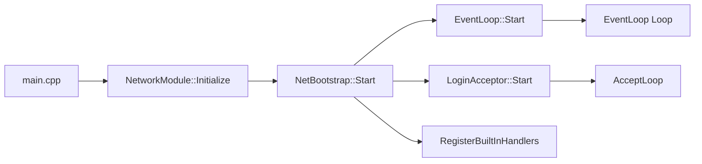
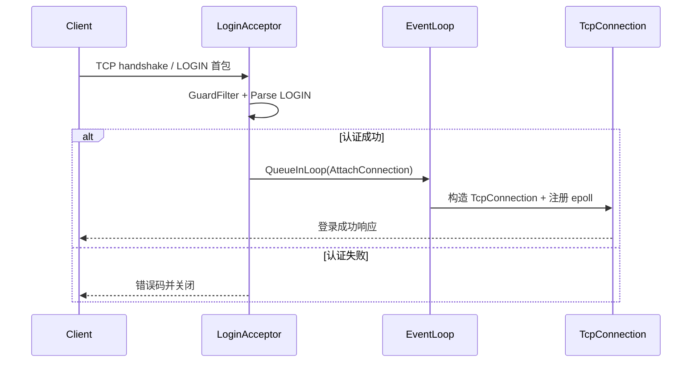
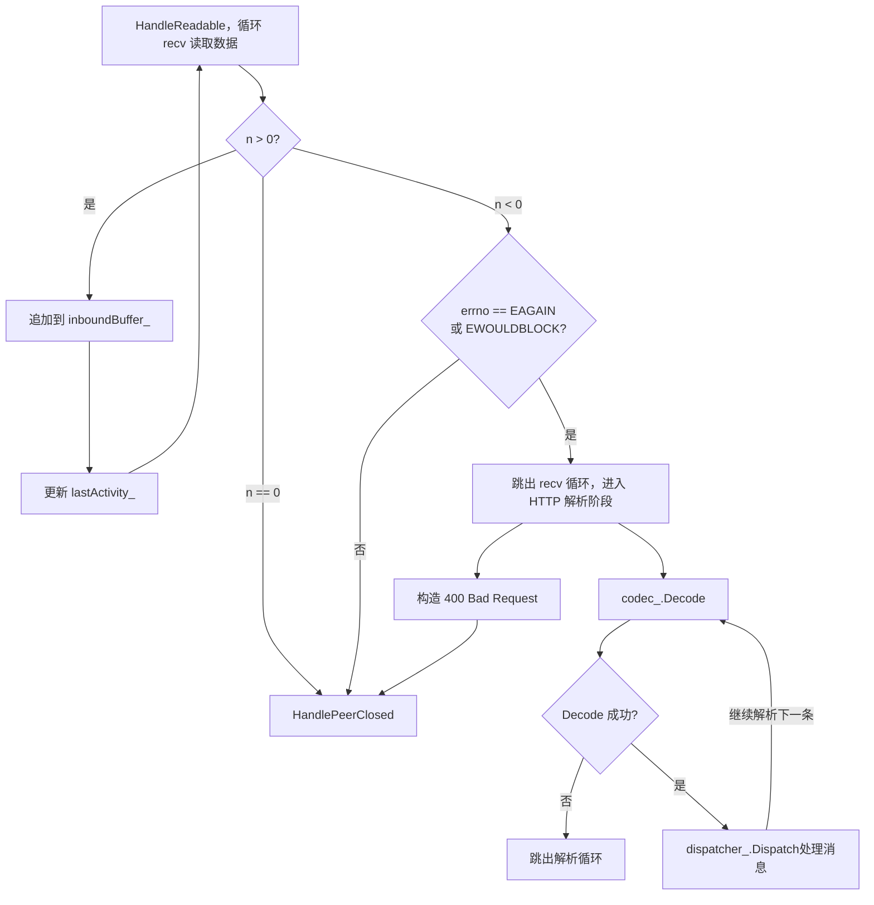

# 网络模块

## 初始化流程

`InitializeNetwork ` 初始化入口，调用NetBootstrap进行启动。

NetBootstrap；

- `oopGroup_->Start()` 拉起 IO 线程池
- `acceptor_->Start()` 接入层最后启动

### EventLoopGroup::Start() for循环启动EventLoop

#### 1. 创建 epoll 实例

```cpp
epollFd_ = ::epoll_create1(EPOLL_CLOEXEC);
```

**epoll 是干嘛的？**

- Linux 下的 **I/O 多路复用机制**
- 用来同时监听大量 fd（socket / eventfd / timerfd 等）

`EPOLL_CLOEXEC` 的意义

> 在 `exec()` 系列函数调用时自动关闭 fd，防止 fd 泄漏

也就是说：

- 如果当前进程 `fork + exec` 启动新程序
- 这个 epoll fd **不会被子进程继承**

👉 这是一个**现代 Linux 编程的好习惯**

#### 2. 创建 eventfd（重点）

```cpp
wakeupFd_ = ::eventfd(0, EFD_NONBLOCK | EFD_CLOEXEC);
```

##### eventfd 是什么？

👉 **一个内核计数器 + 文件描述符**

- 可以像 fd 一样：
  - `write()` → 计数器 +1
  - `read()` → 读出计数器并清零
- 支持 epoll / poll / select

##### 这里 eventfd 的用途

> **跨线程唤醒 EventLoop**

典型场景：

- EventLoop 线程卡在 `epoll_wait`
- 其他线程想：
  - 添加任务
  - 添加 / 删除 fd
  - 让 loop 立刻处理某件事

👉 就往 `wakeupFd_` 里 `write(1)`
 👉 `epoll_wait` 立刻返回

#### 3. 把 wakeupFd 注册到 epoll

```cpp
epoll_event ev{};
ev.events = EPOLLIN;
ev.data.ptr = nullptr;
```

`EPOLLIN`

- 表示：**关注“可读事件”**
- 对 eventfd 来说：
  - 有人 `write()` → 就“可读”

`ev.data.ptr = nullptr` 的设计含义（很重要）

通常 epoll 有两种用法：

- `data.fd = xxx`
- `data.ptr = 指向 Channel / Connection 的指针`

这里用 `nullptr` 表示：

> **这是 wakeupFd 的事件，不是普通 socket**

在 `epoll_wait` 处理时，通常会写成：

```cpp
if (event.data.ptr == nullptr) {
    // 这是 wakeup 事件
}
```

👉 非常常见、非常优雅的区分方式 👍

#### 拓展：`epoll_event` 

```cpp
typedef union epoll_data {
    void*    ptr;
    int      fd;
    uint32_t u32;
    uint64_t u64;
} epoll_data_t;

struct epoll_event {
    uint32_t     events;  // 发生了什么事件
    epoll_data_t data;    // 用户自定义数据
};
```

#### 两个核心字段

1️⃣ `events`：发生了什么

这是 **内核写给你的**，例如：

- `EPOLLIN`  → 可读
- `EPOLLOUT` → 可写
- `EPOLLERR` → 错误
- `EPOLLHUP` → 对端关闭

你在 `epoll_wait` 之后靠它判断**要干啥**。

2️⃣ `data`：这是你自己的“私货”

👉 **epoll 完全不关心它是什么**
 👉 内核只是帮你 **原样带回来**

你在 `epoll_ctl(ADD/MOD)` 时填进去
 `epoll_wait` 返回时，它原封不动地还给你

这就是 epoll 非常强的地方。

#### 使用

传统、低级用法：`data.fd`

```
ev.data.fd = sockfd;
```

返回后：

```
int fd = events[i].data.fd;
```

**问题是：**

- 你只知道 fd
- 你还要：
  - map fd → connection
  - 查状态
  - 查回调
  - 查关注事件

👉 管理成本高、代码散、容易出 bug

------

现代 Reactor 用法：`data.ptr`

```
ev.data.ptr = channel;
```

**直接存一个指针**（Channel / Connection / 对象）

👉 epoll 变成了一个 **“指针分发器”**

### acceptor

> **创建并初始化一个“监听 socket”，让服务器具备接收客户端连接的能力**

#### 整体执行流程（标准 TCP 服务端）

```
Start()
 ├─ socket()        创建监听 socket
 ├─ setsockopt()    设置 socket 选项
 ├─ bind()          绑定 IP + Port
 ├─ listen()        进入监听状态
 └─ 注册到事件循环 / 启动 accept 逻辑
```

#### 1️⃣ 创建监听 socket

```c
int listenfd = socket(AF_INET, SOCK_STREAM, 0);
```

**说明：**

- `AF_INET` / `AF_INET6`：IPv4 / IPv6
- `SOCK_STREAM`：TCP
- 此时 socket 还不能接收连接

#### 2️⃣ 设置 socket 选项（关键）

（1）SO_REUSEADDR（几乎必设）

```c
setsockopt(listenfd, SOL_SOCKET, SO_REUSEADDR, &opt, sizeof(opt));
```

**作用：**

- 允许端口在 `TIME_WAIT` 状态下被重新绑定
- 防止服务重启时报 “Address already in use”

**结论：**

- ✅ 监听 socket 必设
- 没什么副作用

------

（2）SO_REUSEPORT（按架构决定）

```c
setsockopt(listenfd, SOL_SOCKET, SO_REUSEPORT, &opt, sizeof(opt));
```

**作用：**

- 允许多个 socket 绑定同一个 IP + Port
- 内核对新连接做负载均衡

**适用场景：**

- 多进程服务器
- 高并发 accept 场景

**注意：**

- 单进程服务：意义不大
- Linux ≥ 3.9

------

#### 3️⃣ 绑定地址和端口

```c
bind(listenfd, (sockaddr*)&addr, sizeof(addr));
```

**说明：**

- 把 socket 和一个确定的 IP + Port 绑定

#### 4️⃣ 开始监听

```c
listen(listenfd, backlog);
```

**作用：**

- socket 从“普通状态”进入“监听状态”
- 内核开始维护：
  - 半连接队列（SYN queue）
  - 全连接队列（accept queue）

**backlog：**

- 实际值 = `min(backlog, somaxconn)`
- 太小会导致高并发下丢连接

#### 5️⃣ 进入事件系统 / accept 阶段

常见做法：

- 注册到 epoll / poll / select
- 或启动 accept 线程 / 进程

```
Start() 结束后：
监听 socket 常驻内存，等待客户端连接
```

**accept 之后,这里才是：**

- 真正的“客户端连接”
- 一切传输参数从这里开始设置

常见设置：

```c
// 关闭 Nagle，降低延迟
setsockopt(connfd, IPPROTO_TCP, TCP_NODELAY, &opt, sizeof(opt));

// 设置非阻塞
fcntl(connfd, F_SETFL, O_NONBLOCK);

// 接收 / 发送缓冲区
setsockopt(connfd, SOL_SOCKET, SO_SNDBUF, ...);
setsockopt(connfd, SOL_SOCKET, SO_RCVBUF, ...);
```

### 注册系统命令

在 `RegisterBuiltInHandlers()` 中向 `ProtocolDispatcher` 注册系统命令（PING/ECHO/QUIT）

### **初始化总体流程总结**




## 登录请求流程

accept线程拿到 fd → 入队 → worker阻塞握手 → QueueInLoop → loop线程 AttachConnection

### **把“能不能继续占用长连接资源”的判断尽量前置**

为什么这个想法是合理的

1. **节省资源**

- WebSocket 连接一旦建立，通常会占用：连接对象、epoll 关注、心跳、业务状态、内存缓冲、限流桶等。
- 让“登录不了的人”在更早阶段被丢弃，能显著降低这些成本。

2. **抗攻击更强**

- 攻击者最爱做的就是：大量建连 + 不发业务数据/不完成认证。
- 你把认证放在“连接正式接管前”，再配合超时/队列上限，能减少慢连/垃圾连对主循环和 eventloop 的污染。

3. **更符合“接入层”的职责**

- acceptor/网关层做风控、速率限制、粗认证，后面连接层做业务，是常见分层。

### 1. Accept 阶段（Acceptor 线程）

#### 1.1 接收新连接

#### 1.2 基础风控（可选）

- IP / 频率 / 黑名单等快速判定
- 失败立即 `close(fd)`，不进入后续流程

#### 1.3 入登录队列

- 只做入队，不读数据
- Accept 线程迅速返回 accept4，保证接入吞吐

### 2. Pending 登录队列（生产者-消费者）

```cpp
struct PendingConn {
    int fd;
    sockaddr_in addr; // 值拷贝，避免悬空引用
};
```

```cpp
if (pendingQueue_.size() >= maxConnections) {
    close(fd);
    reject++;
    return;
}
pendingQueue_.push_back({fd, addr});
notify_one();
```

- pendingQueue_ 有上限，防止 fd / 内存被打爆
- 超过上限的连接直接拒绝并关闭 fd

### 3. Worker 阶段（登录处理线程）

#### 3.1 WorkerLoop

Worker 线程负责**所有阻塞登录逻辑**

Accept 线程永远不被登录拖慢

#### 3.2 PerformHandshake（登录首包处理）

**Socket 临时配置**

- 设置 `SO_RCVTIMEO = 2s`
- 仅用于登录阶段
- 使用 RAII 在函数退出时恢复原值（避免影响后续 IO）

**首包读取规则**

- 最多读取 **512 字节**
- TCP 是流，循环读读到 `\n` 即停止
- `recv` 错误处理：
  - `EINTR` → 重试
  - `EAGAIN/EWOULDBLOCK` → 登录超时失败
  - `n == 0` → 对端关闭
  - 其他 errno → 失败

 **协议格式**

`LOGIN <account> <token>\n`

- 必须以 `LOGIN` 开头
- account/token 做 Trim
- 剩余数据（首包中多读的）存入 `pendingInbound`

#### 3.3 登录失败

任意校验失败：

- `close(fd)`
- 计数 rejected
- 不进入 eventloop

### **4 登录成功，投递到 EventLoop（IO 线程）**

#### 4.1 登录成功

```cpp
ClientContext:
  - remoteAddress / remotePort
  - account / token
  - pendingInbound
  - state = Authed
```

- 登录成功 ≠ 最终认证完成（取决于后续 token 校验）
- 但允许进入长连接层

#### 4.2 选择目标 loop

`EventLoop* loop = loopGroup_.NextLoop(); // round-robin`

#### 4.3 投递 attach 操作

```c++
loop->QueueInLoop([fd, ctx]() {
    AttachConnection(fd, ctx);
});
```

- 跨线程操作通过 QueueInLoop
- 保证 epoll 注册与后续 IO 都发生在 loop 线程

### 5 AttachConnection（EventLoop 线程）

#### 5.1 fd 初始化

`SetNonBlocking(fd);`

- 从这里开始 fd 进入 **非阻塞 + epoll** 模型
- 不再依赖 `SO_RCVTIMEO`

#### 5.2 创建连接对象

```c
shared_ptr<TcpConnection> connection;
```

- TcpConnection 持有 fd 与 ClientContext

#### 5.3 epoll 注册

```c
epoll_ctl(ADD, fd, EPOLLIN | EPOLLRDHUP | EPOLLERR | (ET?))
```

- 正式进入 reactor 体系

#### 5.4 纳入连接表

```c
connections_[fd] = connection;
```

### 7. 核心边界与约束总结

#### 7.1 accept 线程

- **不阻塞**
- 不读数据
- 不创建 connection 对象

#### 7.2 登录阶段

- 有界：
  - 字节数上限（512）
  - 时间上限（2s）
  - 并发上限（worker 数量）
  - 队列上限（pendingQueue_）
- 登录失败 = fd 生命周期结束

#### 7.3 eventloop 阶段

- 只接收“已通过登录首包”的连接
- fd 统一为 non-blocking
- epoll 管理生命周期

------

### **Q:为什么首包需要设置为2s，但是外面需要关掉？**

现在的 fd 会经历 **两个完全不同的阶段**：

阶段 1：登录首包阶段（PerformHandshake）

- fd 是 **阻塞 socket**
- 你在一个 **worker 线程**里
- 主动 `recv()` 去“等客户端发点东西”

阶段 2：正式连接阶段（EventLoop / epoll）

- fd 被设为 **non-blocking**
- IO 由 epoll 事件驱动
- 你 **不再主动等**，而是“有数据了再读”

这两个阶段，对“等待”的态度是完全相反的。

### Q:首包不是客户端要发来数据吗？怎么会等客户端发数据呢？

#### 客户端侧的真实顺序（TCP 视角）

**客户端不能一上来就 `send`**，它必须先“把连接建起来”。标准顺序是：

```c
socket()
→ connect()
→ （connect 成功）
→ send()
```

关键点在 `connect()`

`connect()` 干的事是：

- 发起 TCP 三次握手
- 等服务端 `accept()` 接住
- **直到连接建立完成，send 才是合法的**

**然后是三种情况：**

#### 情况一：正常客户端

```c
t=0   accept()
t=0   worker 调用 recv()
t=10ms 客户端发 LOGIN\n
t=10ms recv 返回
```

- 等待时间很短
- 看起来“好像没等”

#### 情况二：慢客户端 / 恶意客户端

```c
t=0   accept()
t=0   worker 调用 recv()
t=2s  客户端还没发任何数据
t=2s  recv 超时返回
```

👉 这 **2 秒**，worker 线程是 **完全被占住的**
 这就叫：**等客户端发数据**

#### 情况三：更糟的（如果不设超时）

```c
t=0   accept()
t=0   worker 调用 recv()
t=∞   客户端永远不发数据
```

👉 这个 worker 线程 **永远死在这里**

### 总体流程



## 业务交互-接收

各`EventLoop::Loop()`循环执行，epoll_wait 阻塞等待事件。

### **处理 epoll 事件**

- 若 `data.ptr == nullptr`：
  - 表示 eventfd 唤醒，只需清理计数便可继续执行挂起任务
  - 调用 `HandleWakeup()` 
- 否则：
  - 转发事件给对应的 `TcpConnection::OnEvent`

### `OnEvent` **根据事件进入相应的处理函数**

#### `HandleReadable`处理读事件




## 业务交互-发送

### 发送的两种情况

1. 主动发送
2. 响应式回应

主动发送时，需要利用`SessionManager` 的 `Find`找到对应的`TcpConnection`，然后调用`send`进行发送。

### send

- 业务线程调用 `TcpConnection::Send(const std::string& data)`。如果连接已经在关闭流程（`closing_` true），直接返回；否则用 `shared_from_this()` 拿自引用，并把发送逻辑投递到所属 `EventLoop`：`loop_.RunInLoop([self, data] { ... })`。这样保证真正的写操作一定在网络线程执行。

### EVentLoop处理

- 在 `RunInLoop` 回调里再次确认连接是否关闭，然后先锁住 `outboundMutex_`，把待发字符串 push 到 `outboundQueue_`（一个 `deque<std::string>`）。这队列就是每个连接自己的发送缓冲。随后调用 `FlushOutbound()` 尝试立刻写 socket。
- `FlushOutbound()`会在持有`outboundMutex_`的情况下循环发送队列：
  1. 取队头字符串 `front`，调用 `::send(fd_, front.data(), front.size(), 0)`。
  2. 如果写成功且一次性写完，就弹出队头继续下一条；如果只写了部分，就把已发送的前缀从字符串里删掉，并通过 `loop_.UpdateConnectionEvents(fd_, this, kBaseEvents | EPOLLOUT)` 打开 `EPOLLOUT`，等待内核下次可写再回来补发。
  3. 如果返回 `EAGAIN/EWOULDBLOCK`，说明内核缓冲满了，也注册 `EPOLLOUT` 后退出，等待 epoll 通知。
  4. 其它错误则记录日志并触发 `HandlePeerClosed()`，主动断开连接。
  5. 当队列清空时，把关注事件恢复成只监听 `kBaseEvents`（读/关闭/错误），避免无谓的写事件。

- 当 epoll 收到 `EPOLLOUT`，`TcpConnection::HandleWritable()` 会再次调用 `FlushOutbound()`，继续发送队列里剩下的数据，并在写完后关闭写事件关注。
- 回调的最后一步，调用`EventLoop::UpdateConnectionEvents(fd_, this, …)` 的作用是动态调整 epoll 对该连接关注的事件集合：
  - 当 `FlushOutbound` 检测到还有残留数据（或内核写缓冲满）时，会把监听集合切换成 `kBaseEvents | EPOLLOUT`。这样 epoll 才会在 TCP 发送缓冲重新可写时回调 `HandleWritable()`，让我们继续把队列里没发完的内容写出去。
  - 一旦队列清空，就把关注集合收回到 `kBaseEvents`（只监听读/对端关闭/错误），避免持续监听 `EPOLLOUT` 造成无谓的唤醒。


